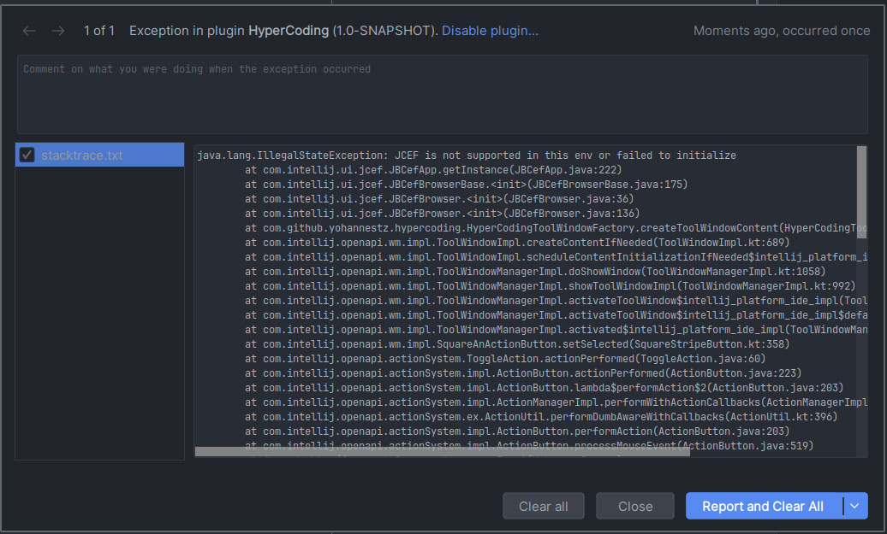
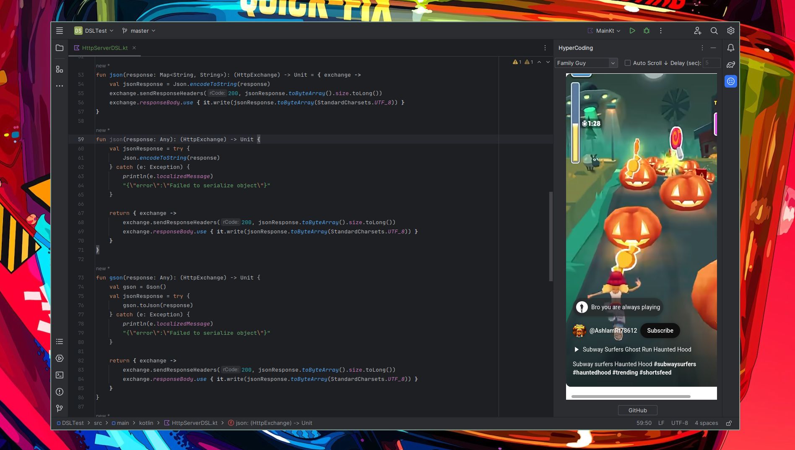

# 🧠 HyperCoding Plugin

A fun, lightweight JetBrains plugin that embeds short YouTube videos (like Subway Surfers or Family Guy clips) into your IDE to give your brain a shot of dopamine while coding!

Ideal for fans of the "hyperfocus with distractions" workflow.

---

## 🖥️ System Requirements

### ✅ JCEF (Java Chromium Embedded Framework) Support

This plugin uses **JCEF** to render web content. To use all features:

- Ensure you're running **IntelliJ IDEA 2020.2+** or a compatible JetBrains IDE that supports JCEF.
- JCEF works on most systems with GUI environments. It may not run in:
    - Headless systems (e.g., SSH sessions without GUI)
    - Minimal Linux distros without proper graphics drivers
    - WSL1 (on Windows)
- For **macOS**, ensure screen permissions are granted.
- For **Linux**, install required graphics packages (e.g., `libxcomposite`, `libxdamage`, `libnss3`).

### 🔧 Troubleshooting

If you see an error like:



Try the following:

1. Run the IDE in a GUI-enabled environment.
2. Update to the latest version of your JetBrains IDE.
3. Make sure hardware acceleration and graphics libraries are installed (for Linux).
4. For advanced users, set VM options:

### Useful links

- https://stackoverflow.com/questions/74164801/how-to-enable-jcef-in-intellij-idea
- https://stackoverflow.com/questions/69171807/markdown-editor-and-preview-not-working-in-android-studio
- https://intellij-support.jetbrains.com/hc/en-us/community/posts/10430962887442-JCEF-is-not-supported-in-Android-Studio

## 🎬 Features

- 📺 **Embedded YouTube Shorts Player** – Watch selected videos inside the IDE.
- 🎮 **Video Presets** – Choose from Family Guy, Subway Surfers, or Temple Run.
- 🎯 **Fullscreen Mode** – Automatically clicks the YouTube fullscreen button.
- ⏬ **Auto Scroll** – Scrolls the video down at custom intervals (simulating infinite scroll).
- 🔗 **GitHub Button** – Opens the plugin author’s GitHub page.

---

## ⚙️ Usage

1. Open any JetBrains IDE (e.g., IntelliJ IDEA, Android Studio, PyCharm).
2. Open the **HyperCoding** tool window from the sidebar.
3. Select your favorite background video from the dropdown.
4. Toggle **Auto Scroll ↓** to enable infinite dopamine.
5. (Optional) Set the scroll delay in seconds.
6. Click the **GitHub** button to visit the creator’s profile.

---

## 📸 Preview



## 🛠 Installation

### 🧩 Manual Installation

1. Clone or download this repository.
2. Build the plugin:

```bash
./gradlew buildPlugin
```

### ⬇️ Releases
Latest releases can be found [here](https://github.com/YohannesTz/HyperCoding/releases)
